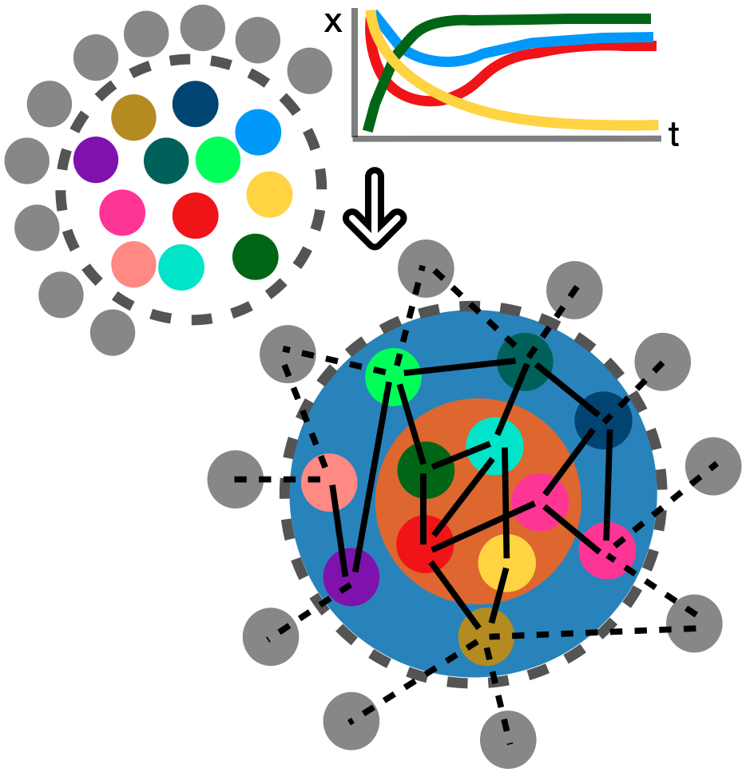

# **Net**work **boun**dary detection algorithm

## Physics-inspired machine learning detects “unknown unknowns” in networks: discovering network boundaries from observable dynamics

This repository contains the implemetation for the paper:

```
Insert paper bib and url.

```

The task tackled in this repository is pictorially described as: 


From dynamical observations (top-right) of the subnetwork (top-left, coloured nodes) embedded in a larger unknown network bulk (unknown grey nodes), using physics-inspired machine learning, we can identify which nodes of the subnetwork lie on its boundary (bottom-right, blue area) and which nodes are in the interior of the network (orange area). The boundary nodes are defined as those that interact significantly with the bulk (dashed lines). As a byproduct, we can also reliably determine the topology and strength of the interactions between the interior nodes (solid lines in orange area).

In this repository we use Python to implement the networks using the [library](https://networkx.org "networkx") `networkx` and define custom dynamics in the various `jupyter` notebooks:
1. Example network with three species
2. Linear network with 100 units
3. Kuramoto Oscillators
4. Roessler Oscillators with Chaotic dynamics
5. Chemical reaction network with five species
6. Epidermal growth factor receptor (EGFR), a real biochemical reaction network

The `packages` contain the `utilities` helper functions and in the notebooks we use the `scipy.linear_model.BayesianRidge` function for implementing the Bayesian Ridge regression to implement the method.